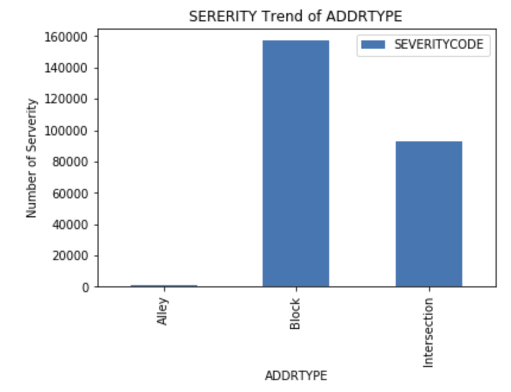
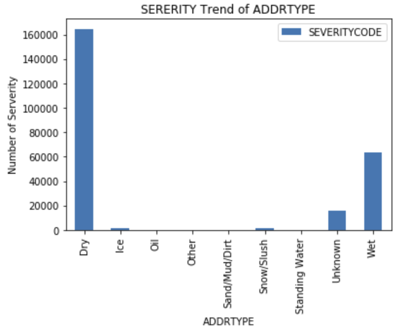
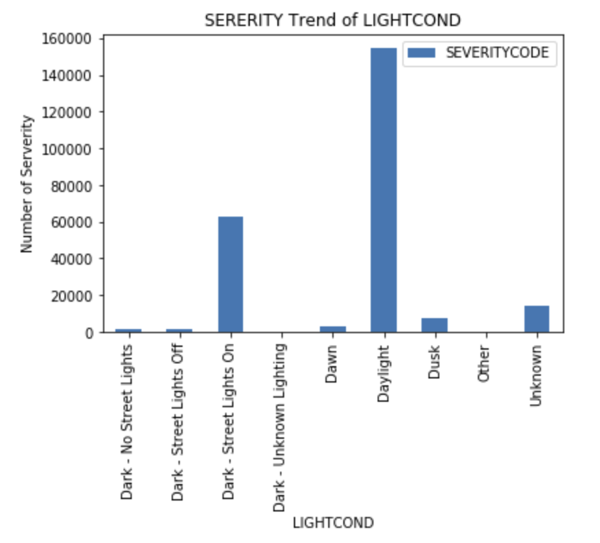

# Predicting the Severity of Car Accident

## 1. Introduction

### 1.1 Background
With the development of high technology, there are many software companies started focusing on AI field. We already have some mature navigation software either for GPS devices, or mobile application and others that can connect to vehicles. Imagine if we are going to drive to another city to visit our friend, before we start driving, check on the navigation tool from which it can provide an overall driving conditions based on the weather, road condition, light condition etc. It can predict the severity of an incident in a certain circumstance and dynamically adjust the data transations on location basis during the driving. This will somehow help everyone avoid the injure tragic happening by avoiding one or more of the factors.

### 1.2 Problem
Driving a car can speed up the time to arrive a place, it can help people moving faster, moreover it also provides a lot of job opportunities. At the same time, driving safe also becomes a improtant topic to community.
This project aims to predict the severity of car accident based on the surrounding circumstance, and find out the factors that most determine the severity.

### 1.3 Interest
When a car is close to a place that satisfies the factors that ever lead a historical accident, it can push a message to warn the driver or passage who is using the navigation tool. Also for some organization or community, goverment, can provide a warning sign or notice to warn drivers to pay attention to avoid the accident.

## 2. Data visualization and pre-processing

### 2.1 Data sources
For this project, we are using the car accident report from Ceattle city from 2004-01-01 to 2019-05-20, it listed out 194673 records, and 37 columns in total. In this dataset, it decribed the accident severity, address type, road condition, light condition, coordinates etc. I noticed there are missing values for certain columns, this will be covered in data cleaning section.

### 2.2 Data Cleaning
The data was downloaded from the provided [link](https://s3.us.cloud-object-storage.appdomain.cloud/cf-courses-data/CognitiveClass/DP0701EN/version-2/Data-Collisions.csv). As I mentioned in last section, there are missing values in some volumns, if we do the following command, we can see 13 columns match this cretaris. they are `X`, `Y`, `INTKEY`, `LOCATION`, `EXCEPTRSNCODE`, `EXCEPTRSNDESC`, `COLLISIONTYPE`, `JUNCTIONTYPE`, `INATTENTIONIND`, `SDOTCOLNUM`, `SPEEDING`, `ST_COLCODE`, `ST_COLDESC`.
```
df.info()
<class 'pandas.core.frame.DataFrame'>
RangeIndex: 194673 entries, 0 to 194672
Data columns (total 38 columns):
SEVERITYCODE      194673 non-null int64
X                 189339 non-null float64
Y                 189339 non-null float64
OBJECTID          194673 non-null int64
INCKEY            194673 non-null int64
COLDETKEY         194673 non-null int64
REPORTNO          194673 non-null object
STATUS            194673 non-null object
ADDRTYPE          192747 non-null object
INTKEY            65070 non-null float64
LOCATION          191996 non-null object
EXCEPTRSNCODE     84811 non-null object
EXCEPTRSNDESC     5638 non-null object
SEVERITYCODE.1    194673 non-null int64
SEVERITYDESC      194673 non-null object
COLLISIONTYPE     189769 non-null object
PERSONCOUNT       194673 non-null int64
PEDCOUNT          194673 non-null int64
PEDCYLCOUNT       194673 non-null int64
VEHCOUNT          194673 non-null int64
INCDATE           194673 non-null object
INCDTTM           194673 non-null object
JUNCTIONTYPE      188344 non-null object
SDOT_COLCODE      194673 non-null int64
SDOT_COLDESC      194673 non-null object
INATTENTIONIND    29805 non-null object
UNDERINFL         189789 non-null object
WEATHER           189592 non-null object
ROADCOND          189661 non-null object
LIGHTCOND         189503 non-null object
PEDROWNOTGRNT     4667 non-null object
SDOTCOLNUM        114936 non-null float64
SPEEDING          9333 non-null object
ST_COLCODE        194655 non-null object
ST_COLDESC        189769 non-null object
SEGLANEKEY        194673 non-null int64
CROSSWALKKEY      194673 non-null int64
HITPARKEDCAR      194673 non-null object
dtypes: float64(4), int64(12), object(22)
memory usage: 56.4+ MB
```
Also I quickly check on the `SERVERITYCODE`, found the data also is balanced. This actually lead me to use classification as supervised deta modeling method.
```
1    136485
2     58188
Name: SEVERITYCODE, dtype: int64
```

### 2.3 Feature Selection
Based on the observation on the raw data, I decided to select few valuable columns for severity prediction.
`df = df[['SEVERITYCODE','ADDRTYPE','ROADCOND','LIGHTCOND','INCDATE']].copy()`
and also drop the rows that has empty values.
`df.dropna()`
As a result, the dataset becomes 187630 rows × 5 columns format so far.

## 3. Exploratory Data Analysis

### 3.1. Calculation of target variable
The severity only have 2 values, `1- Property Damage Only Collision` and `2- Injury Collision`. However, after indepth data analysis, I found out that `SEVERITYCODE` has 3 values, `ADDRTYPE` has 3 values, `ROADCOND` has 9 values, `LIGHTCOND` has 9 values, `INCDATE` it's not datetime type. I decided frop the `INCDATE` column since it's not contribute much to the calculation of target variable.


### 3.2 Relationship between SEVERITYCODE and `ADDRTYPE`,`ROADCOND` and `LIGHTCOND`
By doing the following commands, I found out the values for each columns. 
Image1|Image2|Image3
-|-|-
[||
Most of the accident happened on block|Dry and Wet road confition has more accident|Daylight is the top 1 compare to othres.

`Block` has the most accident, however `Intersection` has the most `Serverity=2` accident (42%), `Alley` has the most `Sererity=1` accident (89%).
```
ADDRTYPE      SEVERITYCODE
Alley         1               0.890812
              2               0.109188
Block         1               0.762885
              2               0.237115
Intersection  1               0.572476
              2               0.427524
Name: SEVERITYCODE, dtype: float64
```
In the known reason list, `Snow/Slush` has the most accident `Severity = 1` (69%), Oil has the most `Severiy=2` (37%)
```
ROADCOND        SEVERITYCODE
Dry             1               0.678227
                2               0.321773
Ice             1               0.774194
                2               0.225806
Oil             1               0.625000
                2               0.375000
Other           1               0.674242
                2               0.325758
Sand/Mud/Dirt   1               0.693333
                2               0.306667
Snow/Slush      1               0.833665
                2               0.166335
Standing Water  1               0.739130
                2               0.260870
Unknown         1               0.950325
                2               0.049675
Wet             1               0.668134
                2               0.331866
Name: SEVERITYCODE, dtype: float64
```
For Light condition column, expected result was that `Dark - No Street Lights` has the most `Severity=1` cases, `Dark - Unknown Lighting` has the most `Severity=2` cases.
```
LIGHTCOND                 SEVERITYCODE
Dark - No Street Lights   1               0.782694
                          2               0.217306
Dark - Street Lights Off  1               0.736447
                          2               0.263553
Dark - Street Lights On   1               0.701589
                          2               0.298411
Dark - Unknown Lighting   1               0.636364
                          2               0.363636
Dawn                      1               0.670663
                          2               0.329337
Daylight                  1               0.668116
                          2               0.331884
Dusk                      1               0.670620
                          2               0.329380
Other                     1               0.778723
                          2               0.221277
Unknown                   1               0.955095
                          2               0.044905
Name: SEVERITYCODE, dtype: float64
```


### 3.3 Convert Categorical features to numerical values


## 4. Predictive Modeling
### 4.1 Regression models
#### 4.1.1 
#### 4.1.2 
#### 4.1.3
#### 4.1.4

## 5. Conclusions

## 6. Future Direction
